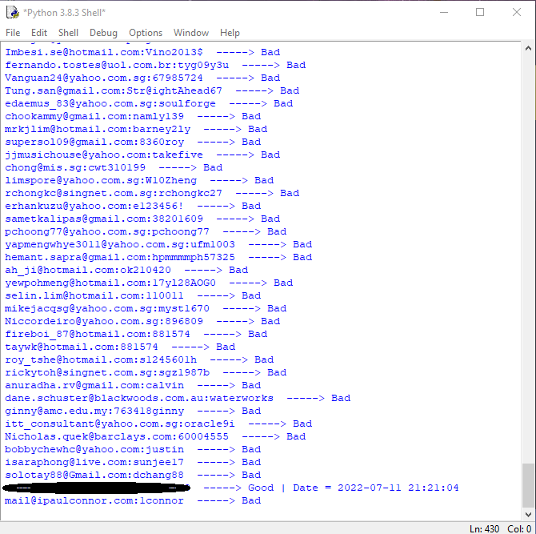

# Important Note!

This method is not working anymore. I hope you enjoyed it in the past 3 years.

# NordVpn_Checker

Nord Vpn Cracker ProxyLess

 

 
		 
		 
		 How To Install:
		 pkg update
		 pkg upgrade
		 pkg install python
		 pkg install base64
		 pkg install requests
		 pkg install re
		 pkg install git
		 
		-- HOW TO Use:
		 
		 git clone https://github.com/Amirtyper/NordVpn_Checker.git
		 cd NordVpn_Checker
		 python NordVpn_Checker.py
		 
		 
		 
# Support me
The easiest way to support me is to click on the star (<g-emoji class="g-emoji" alias="star" fallback-src="https://github.githubassets.com/images/icons/emoji/unicode/2b50.png">⭐</g-emoji>) at the top of <a href="https://github.com/AmirTyper/NordVpn_Checker">GitHub page</a>.

# Contact me
<pre><code>Developer's Telegram: <a href="https://t.me/Mr_Amir_Typer">Mr_Amir_Typer</a>
Developer's Instagram: <a href="https://instagram.com/amir_typer">amir_typer</a>
Developer's Twitter: <a href="https://twitter.com/AmirTyper">AmirTyper</a>
My Website: <a href="https://amirtyper.ir">amirtyper.ir</a>
</code></pre>

		 
